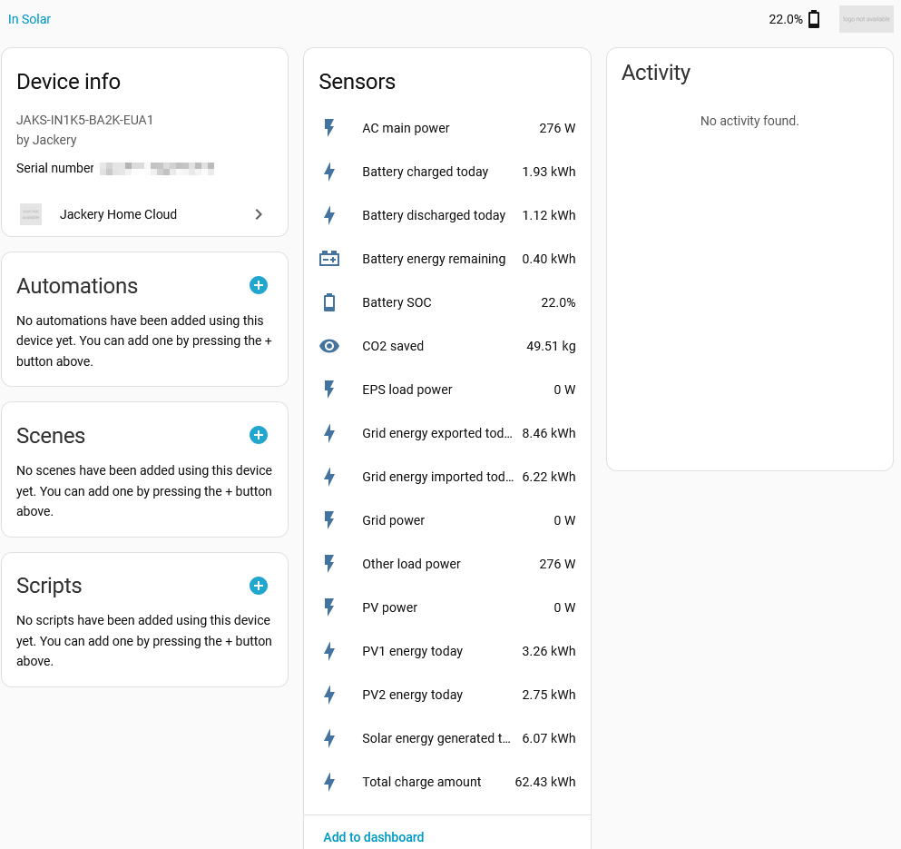

# Jackery Home Cloud for Home Assistant

Unofficial Home Assistant integration for Jackery Home Cloud energy systems.

This integration connects to the Jackery cloud backend, discovers systems linked to a Jackery Home account, and exposes REST- and MQTT-backed data as Home Assistant devices, sensors, controls, schedules, and diagnostics.

> [!WARNING]
> This project is based on reverse-engineered API and MQTT behavior observed from the Jackery Home Android app and supported hardware. It is unofficial, may be incomplete, and can break at any time if Jackery changes its backend, app, firmware, MQTT topics, meter semantics, or certificate infrastructure.

See the [API readme](docs/api.md) for a quick overview.

See the comprehensive [API documentation](docs/jackery_home_cloud_api_readme.md) for observed API calls and implementation notes.

---

## Current status

The Home Assistant integration and the associated API and MQTT research were primarily developed and validated with a Jackery HomePower 2000 Ultra.

Current release: `0.4.1`

The integration is currently able to:

- authenticate against the Jackery Home Cloud API
- automatically generate the required `phone_uid`
- discover systems linked to the user account
- let the user select one or more systems during setup
- create one Home Assistant device per selected Jackery system
- fetch current system data from the cloud
- expose daily energy trend entities
- optionally establish a direct TLS connection to the Jackery cloud MQTT broker
- actively poll MQTT live, total-energy, configuration, and schedule meters
- combine fresh MQTT values with REST fallback data
- expose system-level and BMS1 battery-power telemetry
- expose cumulative MQTT energy totals
- expose MQTT connection and device-status diagnostics
- control operating modes, battery limits, power limits, AC output, and standby behavior through MQTT
- configure charge and discharge schedule windows
- request a device reboot through MQTT
- verify MQTT writes against fresh returned meter values
- provide reconfigure and options flows
- reload the config entry after relevant option changes

The integration combines REST cloud polling with optional Jackery cloud MQTT communication.

MQTT support does not use Home Assistant's own MQTT integration. The Jackery MQTT broker credentials are retrieved from the Jackery cloud API and used directly by this integration.

---

## Features in v0.4.1

### System-oriented device model

Each selected Jackery system is represented as one device in Home Assistant.

This keeps the integration understandable and avoids unnecessary clutter from multiple internal cloud-side components that are not independently modeled by the integration.

For accounts with multiple systems, REST entities remain available for every selected system. The current MQTT implementation is intentionally limited to one explicitly user-selected system per config entry.

### Live cloud data

The integration reads current REST system data such as:

- battery state of charge
- remaining battery energy
- PV power
- grid power
- household or other load power
- operating and status information

Selected existing sensors can prefer fresh MQTT values while continuing to use REST as a fallback when MQTT data is unavailable or stale.

An optional, disabled-by-default `eps_load_power_inverted` sensor exposes
the AC-socket power with its sign reversed. This is useful when an external
AC-coupled solar inverter feeds the Jackery AC socket: feed-in is positive on
the inverted sensor, while consumption is negative.

### Daily energy entities

Daily energy sensors are derived from observed Jackery cloud trend endpoints:

- `solar_energy_generated_today`
- `battery_energy_charged_today`
- `battery_energy_discharged_today`
- `grid_energy_exported_today`
- `grid_energy_imported_today`
- `pv1_energy_today`
- `pv2_energy_today`

Daily battery values are API-based. They are intentionally not sourced from similarly named MQTT meter values because those meter semantics were found to be unsuitable for reliable daily totals.

### Optional MQTT connection

MQTT can be enabled during setup or later through the integration options.

When enabled, the integration:

- retrieves MQTT credentials from the Jackery cloud API
- establishes a TLS connection to the Jackery MQTT broker
- subscribes to device-specific telemetry and LWT topics
- processes cyclic `data_report` messages
- processes `data_get` and `data_set` responses
- actively requests live, cumulative, configuration, and schedule meters
- publishes device-control commands
- verifies supported writes against fresh returned values

The integration supports an option to ignore invalid or expired MQTT TLS certificates. This is currently necessary because Jackery uses its own CA (not public trusted) for its certificates.

> [!WARNING]
> Disabling certificate and hostname verification reduces transport security and increases the risk of man-in-the-middle attacks. Enable this option only when required and only if you understand the implications.

### Active MQTT polling

Version `0.4.0` introduces grouped MQTT polling:

- **Fast live values** for responsive power and battery telemetry
- **Cumulative totals** at a slower interval
- **Configuration values** requested on connection, entity setup, and after writes
- **Schedule values** requested on demand

The fast MQTT polling interval can be configured between 5 and 60 seconds.

A shorter interval improves responsiveness but increases request volume to the Jackery cloud broker.

### MQTT-based cumulative energy entities

The following cumulative energy entities are derived from MQTT meter reports:

- Battery charged
- Battery discharged
- AC-Output energy in
- AC-Output energy out
- PV1 energy
- PV2 energy
- PV energy total

The integration includes monotonicity guards to reject unexpected lower cumulative values that could otherwise distort Home Assistant history or Energy Dashboard statistics.

The MQTT total entities also use state restoration so that the last known value can remain available until a new valid report is received.

### MQTT-backed controls

When MQTT is enabled for the primary system, the integration can provide controls for:

- Work mode
- Grid output power limit
- Discharge limit SOC
- Charge limit SOC
- Feed power limit
- AC Output
- Standby
- Auto standby
- Reboot device

Control availability depends on the observed meter support of the connected Jackery system and firmware.

### Verified MQTT writes

Supported MQTT writes use a verification path that:

1. serializes writes per system and meter
2. generates a fresh request timestamp for each attempt
3. publishes the `data_set` request
4. waits for a fresh returned value
5. compares the returned value with the requested value
6. retries when confirmation is not received
7. requests updated configuration values after successful writes

This reduces the risk of treating a stale cached value as confirmation of a new command.

### Charge and discharge schedules

Version `0.4.0` adds support for reading and managing charge and discharge schedule windows.

The schedule implementation:

- retrieves observed schedule meter values through MQTT
- preserves raw values before normalization
- restores omitted leading zeroes in early-morning times
- exposes current windows through a schedule sensor
- provides entity services for setting windows
- provides entity services for clearing windows

Schedule support is reverse engineered and may vary by model or firmware.

### AC output control

When MQTT is enabled, the integration creates an AC Output switch for the primary MQTT system.

The switch:

- requests its current state after MQTT connection
- updates from `data_get` and `data_set` responses
- sends `data_set` commands to turn AC output on or off
- keeps the last valid state until a newer state is received

### Device reboot

When MQTT is enabled, the integration creates a Reboot device button for the primary MQTT system.

Pressing the button sends the corresponding MQTT command to the selected Jackery system.

### Device connection status

The Device connection diagnostic entity reflects the latest MQTT last-will or status message of the solar generator device:

- `online`
- `offline`

The last known state remains valid until a newer status message is received.

### MQTT diagnostics

When MQTT is enabled for the primary system, the integration can provide:

- MQTT connection status
- Device connection
- MQTT message count
- MQTT last message at
- MQTT last topic

The following technical diagnostics are disabled by default:

- MQTT message count
- MQTT last message at
- MQTT last topic

They can be enabled manually in the Home Assistant entity registry.

### MQTT-dependent entity availability

MQTT-only entities are created only when MQTT is enabled and only for the resolved primary MQTT system.

These include, depending on device support:

- Battery power
- Battery power BMS1
- PV1 power
- PV2 power
- Battery charged
- Battery discharged
- AC-Output energy in
- AC-Output energy out
- PV1 energy
- PV2 energy
- PV energy total
- Device connection
- MQTT diagnostics
- Work mode
- power-limit and SOC-limit controls
- AC Output
- standby controls
- schedule support
- Reboot device

### Multi-system behavior

REST remains available for all selected systems.

Because the Jackery MQTT broker connection only ever subscribes to a single device's topics, exactly one selected system can receive MQTT telemetry and controls:

- If only one system is selected, it is used automatically - no extra step is shown.
- If two or more systems are selected and MQTT is enabled, a dedicated "Select the MQTT system" step lets you choose which one; the others remain REST-only.
- MQTT subscriptions, polling, live-value overlays, diagnostics, controls, and writes are limited to the selected MQTT system.
- The choice can be changed at any time via Reconfigure (or the options flow), and takes effect immediately - both flows reload the integration entry automatically.

Existing installations upgraded from an earlier release are migrated automatically. With a single selected system, it's picked immediately. With more than one, the choice is resolved on the first refresh after upgrading (the first selected system that exposes a usable MQTT connection, matching the previous automatic behavior) rather than guessed at migration time - this avoids picking a system that turns out not to support MQTT and getting stuck retrying setup. Either way, the result can be changed via Reconfigure at any time.

The currently configured and resolved MQTT system is exposed in Settings -> Devices & Services -> Jackery Home Cloud -> Download diagnostics.

Validated multi-system MQTT support (more than one system receiving MQTT simultaneously) is planned for a later release.

### Simplified configuration flows

The initial config flow asks for:

- Jackery Home account
- Jackery Home password
- systems to import
- whether MQTT should be enabled
- whether invalid or expired MQTT TLS certificates should be ignored
- whether raw MQTT debug logging should be enabled
- MQTT live polling interval

The required `phone_uid` is generated automatically.

The reconfigure flow keeps the `phone_uid` visible and editable for troubleshooting or compatibility cases.

---

## Screenshot



---

## Installation

### Option 1: HACS (Recommended)

1. Make sure you have [HACS](https://hacs.xyz/) installed.
2. Open HACS in Home Assistant.
3. Add this repository as a custom repository:
   - Repository: `https://github.com/iLLixM/jackery_home_cloud-ha`
   - Category: `Integration`
4. Search for Jackery Home Cloud.
5. Download the latest release.
6. Restart Home Assistant.
7. Go to **Settings → Devices & services → Add integration**.
8. Search for **Jackery Home Cloud**.

### Option 2: Manual installation

1. Download the latest release archive.
2. Copy the folder:

   ```text
   custom_components/jackery_home_cloud
   ```

   into:

   ```text
   <home-assistant-config>/custom_components/
   ```

3. Restart Home Assistant.
4. Go to **Settings → Devices & services**.
5. Add the Jackery Home Cloud integration.
6. Enter your Jackery account credentials.
7. Select the systems you want to import.

---

## Configuration

The integration uses:

- Jackery Home account email
- Jackery Home password
- an automatically generated stable `phone_uid`
- one or more selected system IDs
- optional MQTT settings

The integration performs a cloud login and then reads system, monitor, device, trend, and MQTT credential data from the Jackery backend.

### Initial setup

During initial setup, the `phone_uid` is generated automatically and is not shown as a free-text field.

The MQTT settings include:

1. Enable MQTT connection
2. Ignore invalid or expired MQTT TLS certificates
3. Enable MQTT raw debug logging
4. MQTT live polling interval

### Reconfigure

The reconfigure flow allows account-related settings and selected systems to be updated.

The `phone_uid` remains visible and editable in this flow so that it can be changed for troubleshooting or compatibility purposes.

Reconfiguration reloads the config entry and recreates the coordinator and MQTT client.

### Options

The options flow provides MQTT connection, TLS, raw-debug, and polling settings.

Relevant option changes reload the config entry so that subscriptions, polling callbacks, and the resolved primary MQTT system remain consistent.

Disabling MQTT does not intentionally delete stored TLS, raw-debug, crypto-key, or polling preferences. These settings remain available if MQTT is enabled again later.

### MQTT polling interval

The live MQTT polling interval can be configured between 5 and 60 seconds.

Use a longer interval to reduce Jackery cloud MQTT traffic. Use a shorter interval only when more responsive values are required.

Cumulative totals use a separate slower interval and are not requested at the same rate as fast live values.

### MQTT TLS option

The option **Ignore invalid / expired MQTT TLS certificates** disables certificate and hostname verification for the Jackery MQTT connection.

> [!WARNING]
> Enabling this option reduces transport security and increases the risk of man-in-the-middle attacks. Use it only when required and only if you understand the implications.

### Raw MQTT debug logging

The option **Enable MQTT raw debug logging** adds verbose MQTT payload information to the Home Assistant log.

Raw payloads may contain:

- device serial numbers
- system identifiers
- topic names
- operational values
- account- or device-related metadata

Do not publish unredacted debug logs.

### Debug logging

To enable integration debug logging in `configuration.yaml`:

```yaml
logger:
  default: info
  logs:
    custom_components.jackery_home_cloud: debug
```

Restart Home Assistant after changing the logger configuration.

### Entity services for schedules

Charge and discharge schedule windows are managed through services attached to the schedule sensor entity.
Use the Home Assistant service UI to inspect the available fields and target the schedule sensor belonging to the intended Jackery system.
Review the returned schedule after every change because schedule meter support may differ across models and firmware versions.

### Energy Dashboard

The cumulative MQTT energy sensors use `SensorStateClass.TOTAL_INCREASING` and can be suitable for Home Assistant long-term statistics and Energy Dashboard use.

Before adding them to the Energy Dashboard:

- verify that values and units are plausible
- observe the entities for a reasonable period
- check for unexpected device-side counter resets
- remove incorrect statistics before relying on derived totals

---

## Project goals

This project is intended to become a stable and useful Home Assistant integration for Jackery Home Cloud systems.

Current and future goals include:

- stable cloud authentication
- robust system discovery
- proper Home Assistant device and entity modeling
- reliable daily energy history sensors
- dependable MQTT-based live telemetry
- safe and verifiable MQTT-backed controls
- explicit MQTT-system selection
- validated multi-system MQTT support
- model and firmware capability detection
- improved diagnostics and error handling
- broader device and regional compatibility
- continued reverse engineering of unsupported API and MQTT areas
- maintainable HACS-compatible packaging
- automated regression testing

---

## Technical notes

- The integration is cloud-dependent.
- REST data is retrieved by cloud polling.
- MQTT data is exchanged with the Jackery-hosted cloud broker.
- The integration does not use Home Assistant's MQTT integration.
- The current Home Assistant `iot_class` remains cloud-based because both communication paths depend on Jackery infrastructure.
- MQTT broker credentials are retrieved from the Jackery cloud API.
- MQTT subscriptions are device-specific.
- The current implementation supports one primary MQTT system per config entry.
- MQTT values are merged only while they remain within their configured freshness windows.
- REST remains the fallback source for selected existing sensors.
- Cumulative MQTT values are protected against unexpected decreases.
- MQTT total sensors use state restoration.
- MQTT writes are serialized per system and meter and verified against fresh values where supported.
- MQTT message processing is isolated defensively so that a failure in one ingest path does not block all other MQTT processing.
- The API and MQTT protocol are unofficial and may change without notice.
- Existing entity-registry entries may remain after MQTT is disabled or after unreleased development entity IDs are changed.

### Technical architecture

```text
Jackery Home Cloud REST API
├── authentication
├── MQTT credential retrieval
├── system discovery
├── system snapshots
└── daily trend data

Jackery Cloud MQTT
├── active fast live-value polling
├── slower cumulative-energy polling
├── configuration polling
├── schedule polling
├── telemetry and data reports
├── LWT device status
├── verified data_set controls
└── device reboot command

Home Assistant runtime
├── one coordinator per config entry
├── REST system bundles
├── frozen primary MQTT-system resolution
├── MQTT live-value and timestamp caches
├── freshness-based MQTT overlays
├── REST fallback
├── entity platforms
└── config-entry reload and unload lifecycle
```

### Troubleshooting MQTT entities

If MQTT entities are unavailable, check:

- MQTT is enabled in the integration options
- the config entry was reloaded after changing options
- the Jackery cloud API returned MQTT credentials
- an eligible primary system and device serial were resolved
- the MQTT connection succeeded
- the selected device publishes to the expected topics
- certificate validation is not blocking the broker connection
- the entity belongs to the primary MQTT system
- the configured polling interval is valid

### Troubleshooting MQTT controls

If a control command does not update the UI:

- check the MQTT connection status
- confirm that the entity belongs to the primary MQTT system
- confirm that the device exposes the expected meter
- look for write-verification timeout or rejection messages
- request the current configuration again by reloading the integration
- collect redacted `data_get` and `data_set` responses when reporting the problem

### Troubleshooting AC Output

The integration expects the device to return meter `23120897` in a `data_get` or `data_set` response.

Useful debug messages include:

```text
Accepted MQTT AC output state ...
```

If commands work physically but the UI does not update, collect a redacted debug log containing the command response.

### Troubleshooting cumulative totals

Rejected lower values should produce debug messages similar to:

```text
Ignoring decreasing MQTT ...
```

If decreases still appear in history, include the relevant raw MQTT payload and entity history in an issue report.

---

## Compatibility

The integration is primarily developed and tested against:

- Jackery HomePower 2000 Ultra
- European Jackery Home cloud infrastructure
- modern Home Assistant versions with config entries, entity descriptions, and `runtime_data`

Because the API and MQTT behavior are reverse engineered, compatibility with all Jackery products, battery-pack combinations, regions, firmware versions, app versions, and future backend variants cannot be guaranteed.

The integration requires:

- internet access
- a functioning Jackery Home account
- access to the Jackery cloud backend
- MQTT credentials returned by the backend when MQTT is enabled
- a device and firmware exposing the expected MQTT topics and meter IDs

Reports from additional regions and device families are welcome.

---

## Contributing

Contributions are very welcome.

Special thanks to [@lachander](https://github.com/lachander) for initiating and implementing the extensive MQTT live-polling and control architecture through [PR #4](https://github.com/iLLixM/jackery_home_cloud-ha/pull/4).

If you are using this project and find problems, please:

- open an issue
- describe your Jackery hardware, battery configuration, firmware, and region
- include the Home Assistant version
- include the integration version
- describe expected and observed behavior
- share relevant redacted logs and MQTT payloads where possible
- report entities or values that appear incorrect

If you want to improve the integration, feel free to open a pull request.

Especially helpful contributions include:

- API observations from additional regions or device families
- MQTT topic and payload observations
- validation of meter semantics
- validation of individual battery-pack and BMS values
- testing on additional Jackery Home systems
- testing with multiple systems in one account
- code quality, typing, and documentation improvements
- translations
- automated tests
- HACS packaging and release workflow improvements

Do not include credentials, tokens, MQTT passwords, or other secrets in public issues.

---

## Feedback wanted

Feedback is explicitly encouraged.

Please comment on:

- incorrect entity names, signs, or units
- missing sensors or controls
- MQTT meter semantics
- system-level versus per-battery-pack values
- unexpected counter resets
- incorrect daily trend interpretation
- device-model and capability decisions
- regional backend differences
- API or MQTT changes observed in newer Jackery app or firmware versions
- behavior of MQTT-backed controls and schedules
- `AC main power` direction in different operating modes
- usability of config, reconfigure, and options flows
- behavior of the automatic primary MQTT-system selection

Security-sensitive findings should be reported privately before technical details are published.

---

## Development status

This is active community software.

Version `0.4.1` builds on the MQTT telemetry and control architecture introduced in v0.4.0. It adds explicit MQTT-system selection, expanded protocol diagnostics, AC-output energy counters, hardened MQTT freshness and restore handling, and more robust AC-main direction inference, including stable negative standby consumption.

The integration should still be treated as unofficial software that depends on undocumented interfaces.

Backend, firmware, certificate, topic, payload, or meter changes can require updates at any time.

If you test it, review it, report issues, or improve it: thank you.

---

## Disclaimer

This repository is not affiliated with, maintained by, sponsored by, or endorsed by Jackery.

All product names, trademarks, and registered trademarks are the property of their respective owners.

Use this integration at your own risk.
